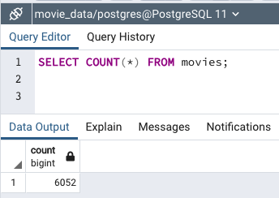
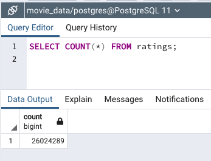

# Movies-ETL

## Project Overview
In this fictional project, Amazing Prime Video is one of the largest streaming services for movies, TV shows and other content. The streaming team wanted to develop an algorithm to predict which low budget films would become popular in order to better inform purchase decisions with regards to streaming rights. To accomplish this goal, the streaming team decided to sponsor a hackathon to invite coders to put together their best efforts in a friendly competition. To prepare for the hackathon, a single clean data set needed to be created from two raw data sources; (1) Wikipedia data scrape of movies since 1990, and (2) a Kaggle movie metadata set. To create the single clean dataset, Extract, Transform, and Load procedures were performed as described in more detail below. 

Additionally, the streaming team wanted an automated pipeline that would take in new data, perform appropriate transformations, and then load the data into tables. Specifically, the team wanted a function that would perform three tasks; (1) take in three files (Wikipedia JSON data,  Kaggle metadata, and  MovieLens rating data), (2) transform the data into a cleaner version, and (3) add the data to a PostgreSQL database.

### Resources
 * Python
 * Jupyter Notebooks
 * PostgreSQL
 * pgAdmin 4

Data:
 * Wikipedia data scrape JSON file
 * Kaggle movies metadata 
 * MovieLens Ratings .csv data file with over 26 million data rows

## Overview of the ETL Process
First the data files needed to be Extracted. They were downloaded from their source and then a function was created to read the data into the code for transformation. The three files were then converted to Pandas dataframes for processing. 

During the Transform phase, a number of steps were taken to convert the raw data from the three files into a format that was optimized for the desired use. For example, list comprehension was used to filter out TV shows, columns dominated with null values were dropped, regular expressions were used to identify and remove duplicate rows, and numerical data was parsed and formatted for consistency. Additionally, the wikipedia data and Kaggle data was merged, redundant and unnecessary columns were removed, and the columns were reordered. The ratings data was then merged to match ratings with movies retained in the transformation.

To Load the data, a database was created with a connection for importing. First, a database was initiated in PostgreSQL. Then, in the function, a connection was created to the database. Finally code was written to import the data after transformation into two tables in the database. One table for the transformed movie data, and one table for the ratings data. 

## Summary
In summary,  three raw data files were used to create one file that included the desired information about thousands of movies and their ratings. To accomplish this, a comprehensive Extract, Transform, Load procedure was conducted to clean, merge, format, reduce, and otherwise optimize millions of data points. A function was then created to automate this process when passing the three datafiles that would then load the movie file along with a file for the ratings into a database for further SQL query investigations.  

SQL Query for rows in Movies Data

SQL Query for rows in Ratings Data

